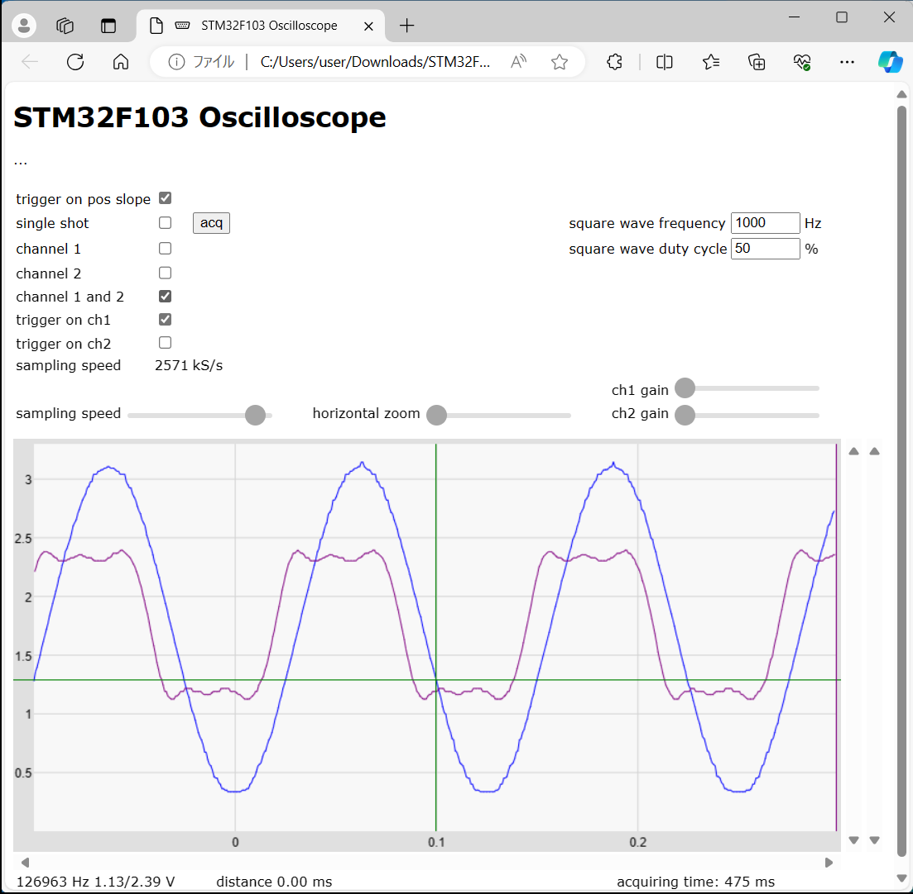
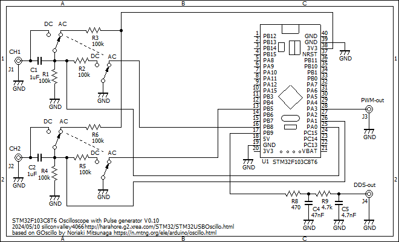

# STM32F103C8T6USBOscilloscope
STM32F103C8T6 USB dual channel oscilloscope with Pulse Generator, DDS Function Generator

This displays an oscilloscope screen on the WEB page of the PC which is conected to the STM32F103C8T6 board with a USB cable.
The settings are controled on the WEB page.

Specifications:
<li>Dual input channel</li>
<li>Input voltage range 0 to 3.3V</li>
<li>12 bit ADC 5.14 Msps single channel, 2.57 Msps dual channel</li>
<li>Measures minimum and maximum values</li>
<li>Measures frequency</li>
<li>Sampling rate selection</li>
<li>Built in Pulse Generator</li>
<li>Built in DDS Function Generator</li>
 

Develop environment is: 
Arduino IDE 1.8.19 
STM32F1xx/GD32F1xx boards by stm32duino version 2022.9.26 
(additional URL: http://dan.drown.org/stm32duino/package_STM32duino_index.json ) 
CPU speed 72MHz 

Libraries: 
arduinoFFT by Enrique Condes 2.0.0 

Schematics: 

Usage: 
Upload the scketch from Arduino IDE with Upload Method: "STM32duino bootloader". 
Open the HTML file "STM32F103scope.html" on the Windows PC and select the communication port at upper left area of the web page.

Description is here, although it is written in Japanese language: 
http://harahore.g2.xrea.com/STM32/STM32USBOscillo.html
